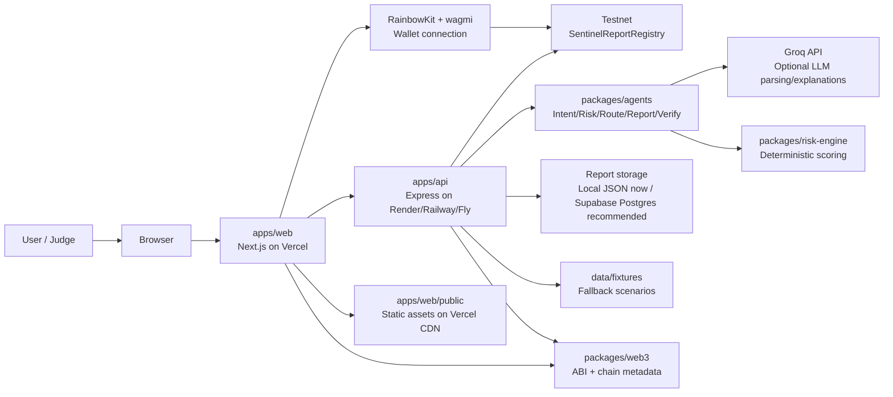

# SentinelMesh Deployment Architecture

This document maps every major folder/service in the repository to its deployment role and recommended platform.

## Optimal Architecture Summary

Recommended deployment:

- Frontend: Vercel
- Backend API: Render web service for the hackathon demo; Railway/Fly.io are acceptable alternatives
- Database/report storage: Supabase Postgres for deployed persistence; local JSON only for local/demo fallback
- AI API: Groq hosted API, called from the backend agent package
- Authentication: wallet-only authentication via RainbowKit/wagmi, no traditional login in v0
- File/static assets: Vercel static asset hosting for `apps/web/public`
- Smart contract: deployed separately to a testnet such as Base Sepolia or Ethereum Sepolia

This keeps the product simple, cheap, and judge-friendly while avoiding overbuilding infrastructure before the v0 loop is proven.

## Component Inventory

### Root

- What it does: npm workspace root, shared scripts, package lock, repo-level docs/config.
- Type: monorepo orchestration.
- Deploy on: not deployed directly.
- Why: it coordinates workspace installs/builds for web, API, packages, and contracts.
- Free tier: n/a.
- Env vars: none directly.
- Scalability concerns: keep workspace scripts stable; deployment platforms must install from the root so workspace packages resolve.

### `apps/web`

- What it does: Next.js App Router frontend, landing page, copilot dashboard, wallet UI, report history, report detail pages.
- Type: frontend + static assets.
- Deploy on: Vercel.
- Why: Vercel has first-class Next.js support, preview deployments, environment variable management, and CDN/static asset delivery.
- Free tier: yes for hackathon/demo use, subject to Vercel account/usage limits.
- Required env vars:
  - `NEXT_PUBLIC_API_URL`
  - `NEXT_PUBLIC_WALLETCONNECT_PROJECT_ID`
  - `NEXT_PUBLIC_REPORT_REGISTRY_ADDRESS`
  - `NEXT_PUBLIC_CHAIN_ID`
  - `NEXT_PUBLIC_EXPLORER_TX_URL_TEMPLATE`
  - `NEXT_PUBLIC_EXPLORER_LABEL`
- Scalability concerns:
  - Client calls backend API directly, so API CORS and availability matter.
  - Wallet RPC performance depends on public RPC/provider quality.
  - Keep frontend on Vercel and avoid putting API-only secrets in public env vars.

### `apps/api`

- What it does: Express API for intent parsing, risk analysis, route recommendation, report creation/history, and report verification.
- Type: backend service + AI/API orchestrator + local storage adapter.
- Deploy on: Render web service for simplest deployment; Railway/Fly.io also work.
- Why: long-running Express server with `/health`, simple Node start command, environment variable support, and easy logs.
- Free tier: yes for hackathon demos on Render/Railway-style platforms, but expect sleep/spin-up behavior and limits.
- Required env vars:
  - `PORT`
  - `REPORTS_DB_PATH`
  - `GROQ_API_KEY`
  - `GROQ_MODEL`
  - `REPORT_REGISTRY_ADDRESS`
  - `REPORT_REGISTRY_CHAIN_ID`
  - `REPORT_REGISTRY_RPC_URL`
  - `ALLOW_CLIENT_SUPPLIED_ONCHAIN_HASH`
  - optional fallback RPC vars: `BASE_SEPOLIA_RPC_URL`, `SEPOLIA_RPC_URL`
- Scalability concerns:
  - `data/reports.json` is not durable on many PaaS free tiers and is not safe for concurrent writes at scale.
  - Move reports to Supabase/Postgres before real public usage.
  - Add rate limits before opening public traffic.
  - Groq/API latency can slow `/api/intent`; deterministic fallback helps demo reliability.

### `packages/shared`

- What it does: shared TypeScript types and Zod schemas for intents, risks, routes, agents, reports.
- Type: shared library.
- Deploy on: bundled into frontend and backend builds.
- Why: not a standalone service.
- Free tier: n/a.
- Env vars: none.
- Scalability concerns: schema changes affect both web/API; version carefully.

### `packages/agents`

- What it does: IntentAgent, RiskAgent, RouteAgent, ReportAgent, VerificationAgent, optional Groq calls, report hashing.
- Type: AI service logic/library.
- Deploy on: bundled into `apps/api`.
- Why: agents currently run server-side inside the API; no separate worker is needed for v0.
- Free tier: covered by API host and Groq account limits.
- Required env vars:
  - `GROQ_API_KEY`
  - `GROQ_MODEL`
- Scalability concerns:
  - LLM calls should be rate-limited and cached if traffic grows.
  - Keep deterministic fallback for demo reliability and cost control.
  - Do not expose Groq key to frontend.

### `packages/risk-engine`

- What it does: deterministic risk scoring, risk factor explanation, legacy route recommendation rules.
- Type: backend/domain library.
- Deploy on: bundled into `apps/api`.
- Why: pure TypeScript logic, no standalone compute needed.
- Free tier: n/a.
- Env vars: none.
- Scalability concerns: computationally cheap; main concern is correctness and tests.

### `packages/web3`

- What it does: registry ABI, supported testnet chain metadata, Web3 adapter placeholders, explorer URL helpers, transaction state labels.
- Type: Web3/shared library.
- Deploy on: bundled into frontend and backend.
- Why: used by both wallet UI and API verification.
- Free tier: n/a.
- Env vars consumed by callers:
  - `NEXT_PUBLIC_REPORT_REGISTRY_ADDRESS`
  - `NEXT_PUBLIC_EXPLORER_TX_URL_TEMPLATE`
  - `REPORT_REGISTRY_ADDRESS`
  - `REPORT_REGISTRY_RPC_URL`
- Scalability concerns:
  - Replace placeholder adapters with final deployed chain metadata after contract deployment.
  - RPC reliability matters for verification reads.

### `contracts`

- What it does: Solidity `SentinelReportRegistry`, Foundry tests, deployment script.
- Type: smart contract source/deployment artifact.
- Deploy on: testnet using Foundry, not Vercel/Render.
- Why: contract is deployed to chain once; app consumes ABI/address.
- Free tier: testnet deployment costs only faucet funds; block explorer verification may require API setup.
- Required env vars:
  - `BASE_SEPOLIA_RPC_URL`
  - `SEPOLIA_RPC_URL`
  - `PRIVATE_KEY`
- Scalability concerns:
  - Registry arrays per user can grow; acceptable for hackathon v0 but may need pagination/events/indexer later.
  - Never use a private key with real funds for deployment.

### `data`

- What it does: fixture scenarios and local `reports.json`.
- Type: fixture data + local development storage.
- Deploy on: fixtures can ship with API; report storage should move to Supabase/Postgres for deployment.
- Why: local JSON is fine for demos but not durable on ephemeral hosts.
- Free tier: Supabase free tier is suitable for a hackathon database.
- Env vars if migrated:
  - `DATABASE_URL` or Supabase URL/service key
  - keep service key backend-only
- Scalability concerns:
  - JSON file has race/durability limits.
  - Use database row-level timestamps and indexes for report history.

### `docs`

- What it does: architecture notes, deployment checklist, demo/submission script.
- Type: documentation/static repo assets.
- Deploy on: GitHub repo; optionally linked from README.
- Why: not runtime code.
- Free tier: n/a.
- Env vars: none.
- Scalability concerns: keep updated after public URLs and contract address are known.

### `apps/web/public`

- What it does: static images/assets served by Next.js.
- Type: static assets.
- Deploy on: Vercel CDN with `apps/web`.
- Why: Next.js handles `public/` files automatically.
- Free tier: yes for demo-scale assets.
- Env vars: none.
- Scalability concerns: optimize large images before final submission.

## Authentication

There is no email/password auth service in v0. User identity is wallet-based:

- Frontend: RainbowKit/wagmi handles wallet connection.
- Backend: reports can store `userAddress`, but there is no signed-session auth yet.

Recommended final v0 stance: keep wallet connect only. Add signed messages/SIWE later if private user history becomes necessary.

## Storage And Database Recommendation

Current:

- Local JSON report storage at `data/reports.json`.

Recommended deployment:

- Supabase Postgres for report history.

Why:

- Durable persistence across API restarts.
- Easy free-tier hackathon setup.
- SQL queries for report history/search.
- Later supports wallet-scoped history, indexes, and admin review.

For this local pass, the code still uses JSON storage. Treat Supabase migration as the next deployment hardening step if the API is hosted on an ephemeral filesystem.

## Architecture Diagram

## Deployment Table

| Component | Purpose | Deploy On | Reason |
|-----------|---------|-----------|--------|
| `apps/web` | Next.js product UI, dashboard, report pages, wallet UI | Vercel | Best fit for Next.js, CDN, preview deployments, simple env management |
| `apps/api` | Express backend, agent orchestration, report API | Render web service | Simple long-running Node service with health checks and logs |
| Supabase Postgres | Durable report history database | Supabase | Replaces local JSON for deployed persistence; simple free-tier database |
| Groq API | Optional LLM intent parsing and risk explanation | Groq hosted API | Keeps AI inference external; backend can fall back when unavailable |
| `contracts` | Report registry contract source/deploy scripts | Testnet via Foundry | Smart contracts deploy to chain, not web hosting |
| `packages/shared` | Shared schemas/types | Bundled into web/API | Library, not a standalone service |
| `packages/agents` | Agent logic and report hashing | Bundled into API | Server-side orchestration, keeps secrets backend-only |
| `packages/risk-engine` | Deterministic risk scoring | Bundled into API | Pure domain logic, cheap to run in API |
| `packages/web3` | ABI, chain metadata, Web3 helpers | Bundled into web/API | Shared Web3 definitions for frontend transactions and backend verification |
| `data/fixtures` | Demo/fallback scenarios | Bundled with API | Keeps demo reliable without live data APIs |
| `data/reports.json` | Local report storage | Local only; replace with Supabase | PaaS filesystems can be ephemeral and unsafe for concurrent writes |
| `apps/web/public` | Static images/assets | Vercel CDN | Next.js serves public assets automatically |
| `docs` | Deployment/demo documentation | GitHub repository | Documentation only |

## Free-Tier Suitability

- Vercel: suitable for frontend demo.
- Render/Railway/Fly: suitable for API demo; free/low-cost tiers may sleep or have usage limits.
- Supabase: suitable for hackathon-scale report persistence.
- Groq: depends on current account limits; deterministic fallback keeps the app usable.
- Testnet contracts: suitable with faucet funds.

## Main Scalability Risks

1. Local JSON report storage is not production-grade.
2. No API rate limiting yet.
3. No signed wallet authentication for private user histories.
4. Groq/API failures can add latency, though fallback exists.
5. Registry read strategy uses per-user report arrays; indexer/event search may be needed later.
6. API and frontend are deployed separately, so CORS/API URL configuration must be correct.
